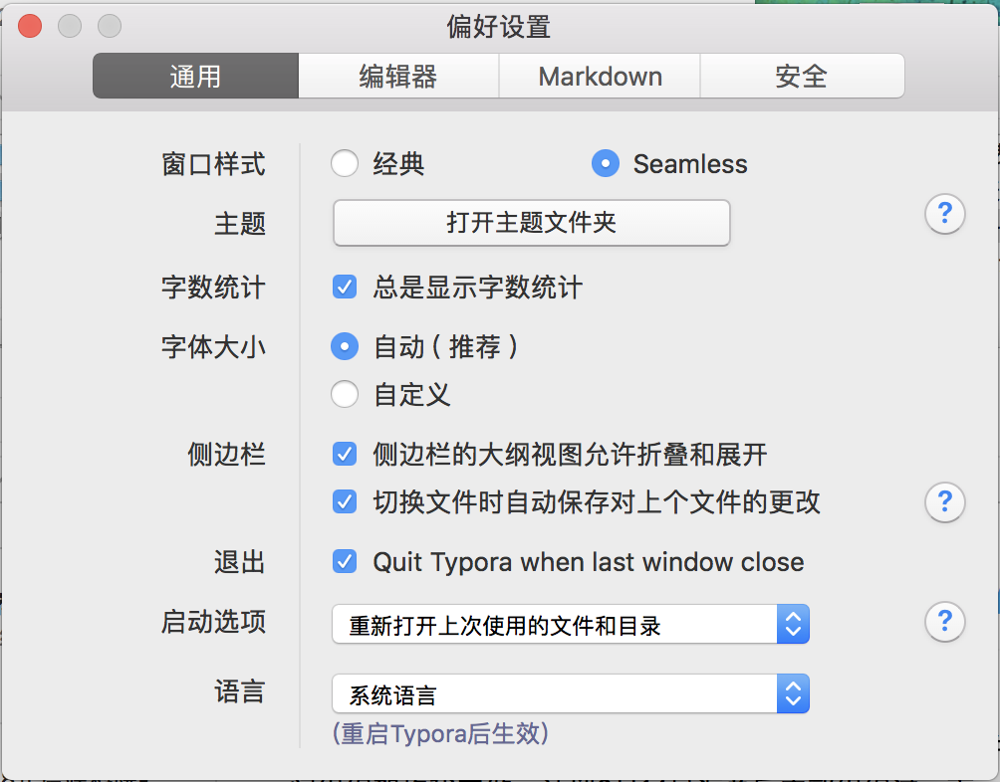
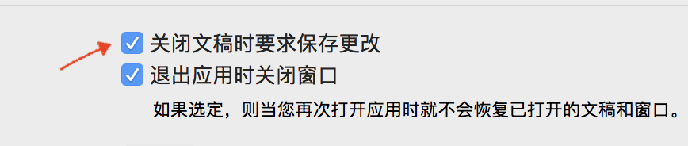
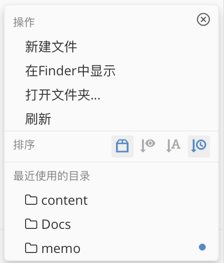

[Typora](https://typora.io) 是一款非常好用跨平台 Markdown 编辑器。和很多类似的软件一样使用 Web 技术开发，并使用 Electron 封装成桌面应用，目前 beta 版可以免费下载使用，写这篇博客的时版本是 `0.9.9.16.2`。

Typora 新版本增加了很多功能，这里记录一下个人在使用过程中的一些偏好设置与小技巧（基于 MacOS）。


## 命令行启动

很多时候工作流程会使用 git 命令对文档进行版本管理，为了快速的在命令行启动 Typora，我通过添加别名`t`来快速启动 Typora。在 `~/.bash_profile` 中添加  `alias t="open -a typora"`，执行`source ~/.bash_profile`后，就可以在命令行中运行 `t path/to/filename.md` 以快速打开并开始编辑文件。

新版 Typora 支持了文件夹模式，所以可以运行`t path` 打开整个文件夹，或者 用`t .` 打开当前文件夹。


### ，偏好设置


按 <kbd>Command</kbd> + <kbd>,</kbd> 打开偏好设置面板。

> 偏好设置可以根据个人喜好的设置，这里列出了一些我自己的喜好，也许在今后的深入使用过程中会更改这些设置。



### 自定义主题

> 可以在偏好设置面板点击『打开主题文件夹』查看所有样式文件，详细说明查看官方文档：https://support.typora.io/Add-Custom-CSS/

我比较喜欢 github 主题，但我希望改变一下背景颜色，让眼睛更舒适，在主题文件夹新建 `github.user.css`文件，添加如下代码：

```css
body{
  background-color: #f3f2ee;
}
```


然后再新增 `base.user.css` 文件，在里面添加一些自定义的样式，这个文件是针对所有主题都起作用的。

```CSS
/* 添加自动序号样式 */
#write {
    counter-reset: h2
}

h1 {
    counter-reset: h2
}

h2 {
    counter-reset: h3
}

h3 {
    counter-reset: h4
}

h4 {
    counter-reset: h5
}

h5 {
    counter-reset: h6
}

#write h2:before {
    counter-increment: h2;
    content: counter(h2) ". "
}

#write h3:before,
h3.md-focus.md-heading:before /** override the default style for focused headings */ {
    counter-increment: h3;
    content: counter(h2) "." counter(h3) ". "
}

#write h4:before,
h4.md-focus.md-heading:before {
    counter-increment: h4;
    content: counter(h2) "." counter(h3) "." counter(h4) ". "
}

#write h5:before,
h5.md-focus.md-heading:before {
    counter-increment: h5;
    content: counter(h2) "." counter(h3) "." counter(h4) "." counter(h5) ". "
}

#write h6:before,
h6.md-focus.md-heading:before {
    counter-increment: h6;
    content: counter(h2) "." counter(h3) "." counter(h4) "." counter(h5) "." counter(h6) ". "
}

/** override the default style for focused headings */
#write>h3.md-focus:before,
#write>h4.md-focus:before,
#write>h5.md-focus:before,
#write>h6.md-focus:before,
h3.md-focus:before,
h4.md-focus:before,
h5.md-focus:before,
h6.md-focus:before {
    color: inherit;
    border: inherit;
    border-radius: inherit;
    position: inherit;
    left:initial;
    float: none;
    top:initial;
    font-size: inherit;
    padding-left: inherit;
    padding-right: inherit;
    vertical-align: inherit;
    font-weight: inherit;
    line-height: inherit;
}

/* 自定义强制换号符，使得在导出PDF 或打印时强制换行 */
@media print {
    /* 这是自定义标签, 在需要换行的地方插入：<pb> */
    pb {
        display: block;
        page-break-after: always;
    }
    h1 {
        page-break-before: always;
    }
    h1:first-of-type {
        page-break-before: avoid;
    }
}	

/* 完成的 Task 添加删除线 */
.task-list-done {
    text-decoration: line-through;
    color: #777;
}
.task-list-not-done {

}

/* 添加键盘样式 */
kbd{
    box-shadow: inset 0 -2px 0 #c6cbd1;
    background-color: white;
}

/* TOC 中隐藏 H1 和 H6 */
.md-toc-h1,.md-toc-h6 {
  display: none;
}

/* 添加 TOC 自动序号样式 */
.md-toc-content {
    counter-reset: toc-h2
}

.md-toc-h1 {
    counter-reset: toc-h2
}

.md-toc-h2 {
    counter-reset: toc-h3
}

.md-toc-h3 {
    counter-reset: toc-h4
}

.md-toc-h4 {
    counter-reset: toc-h5
}

.md-toc-h5 {
    counter-reset: toc-h6
}

.md-toc-content .md-toc-h2 a:before {
    counter-increment: toc-h2;
    content: counter(toc-h2) ". "
}

.md-toc-content .md-toc-h3 a:before {
    counter-increment: toc-h3;
    content: counter(toc-h2) "." counter(toc-h3) ". "
}

.md-toc-content .md-toc-h4 a:before{
    counter-increment: toc-h4;
    content: counter(toc-h2) "." counter(toc-h3) "." counter(toc-h4) ". "
}

.md-toc-content .md-toc-h5 a:before{
    counter-increment: toc-h5;
    content: counter(toc-h2) "." counter(toc-h3) "." counter(toc-h4) "." counter(toc-h5) ". "
}

.md-toc-content .md-toc-h6 a:before{
    counter-increment: toc-h6;
    content: counter(toc-h2) "." counter(toc-h3) "." counter(toc-h4) "." counter(toc-h5) "." counter(toc-h6) ". "
}
```


### 效率提升

#### 打开与关闭

我希望关闭最后一个文档时自动退出 Typora，并且在重新运行 Typroa 时可以自动帮我打开上一次使用的文件或者目录，在偏好设置中的通用面板中做如下选择：

- **退出** - 勾上 Quit Typora when last window close
- **启动选项** - 选择『重新打开上次使用的文件和目录』
- **侧边栏** - 切换文件时自动保存上个文件的更改（如果这个选项不能被选中，则需要在『系统偏好设置-通用』中把『关闭文稿是要求保存更改』勾上）





#### 大纲与文件

利用新版本 Typora 在侧边栏中的文档试图可以大幅度提高写作效率。可以在侧边栏切换大纲视图与文档视图，文档视图又可以按列表或者树来显示。在侧边栏的底部有快捷操作按钮，可以打开文件夹，或者在打开的文件夹中新增一个文档。



#### 图片处理

新版本 Typora 增强了 Markdown 文档嵌入图片的体验，现在可以直接从文件夹或者网页拖放图片到文档中，也可以通过截图粘贴到文档，Typora 可以自动帮我把图片复制到文档相对的目录中，在偏好设置的编辑器面板中：

- **图片插入** - 选择『复制图片到 ./assets 文件夹』

> 图片插入还有其他一些选择，比如通过 IPic 上传到云平台，不过我暂时还没有尝试。

### 其他

还有很多其他的设置，比如开启触发自动完成 Emoji :rocket:，复制 Markdown 源码，启用 Markdown 扩展语法等等，详细说明都可以在 [官方支持网站](https://support.typora.io) 中找到。

